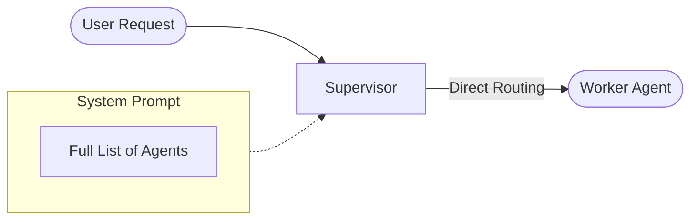
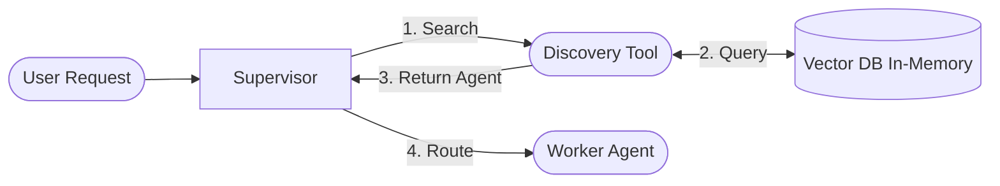

# Agent Discovery & Routing Modes

RadOps supports two distinct modes for routing tasks to agents, allowing you to scale from a handful of specialists to hundreds of agents without overwhelming the Supervisor's context window.


## 1. Prompt Mode (Default)

In **Prompt Mode**, the Supervisor is explicitly aware of every available agent. The system injects the description and capabilities of all configured agents directly into the Supervisor's system prompt.

### How Agents are Added to the Prompt

When the Supervisor is initialized, it iterates through all agents defined in `config.yaml`. It constructs a description for each team member using the following precedence:

1.  **System Prompt File**: If `system_prompt_file` is defined, its content is included in the Supervisor's prompt. This allows the Supervisor to have a deep understanding of the agent's persona and instructions.
2.  **Description Field**: If no file is provided, the `description` field from `config.yaml` is used as a fallback.

*   **Best For:** Small deployments (typically < 15 agents).
*   **Mechanism:** The LLM sees the full list of agents and selects the best one based on the user's request.
*   **Pros:**
    *   **Speed:** Zero-shot routing. The Supervisor picks an agent immediately without an intermediate tool call.
    *   **Simplicity:** Easier to debug as the agent list is visible in the prompt.
*   **Cons:**
    *   **Context Limit:** As you add more agents, the system prompt grows, consuming valuable tokens and potentially confusing the LLM.



## 2. Discovery Mode

In **Discovery Mode**, the Supervisor does not know about all agents upfront. Instead, it uses a specialized tool (`system__agent_discovery_tool`) to search for the right agent based on the task description.

*   **Best For:** Large deployments (Unlimited agents).
*   **Mechanism:**
    1.  RadOps indexes all agent descriptions into a vector database (FAISS) at startup.
    2.  When a task arrives, the Supervisor calls the discovery tool with a query.
    3.  The tool performs a semantic search and returns the most relevant agent(s).
*   **Pros:**
    *   **Scalability:** You can have hundreds of agents without impacting the Supervisor's prompt size.
    *   **Focus:** The Supervisor focuses on planning rather than memorizing agent capabilities.
*   **Cons:**
    *   **Latency:** Requires one additional tool execution step to find the agent.



## Configuration

You can configure the routing mode in your `config.yaml` under `agent.supervisor`:

```yaml
agent:
  supervisor:
    # Options: "prompt" (default) or "auto" (enables discovery)
    discovery_mode: "prompt"
    # The threshold for agent discovery relevance (default: 1.6)
    discovery_threshold: 1.6
```