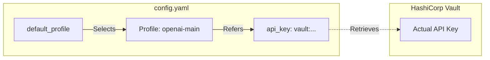
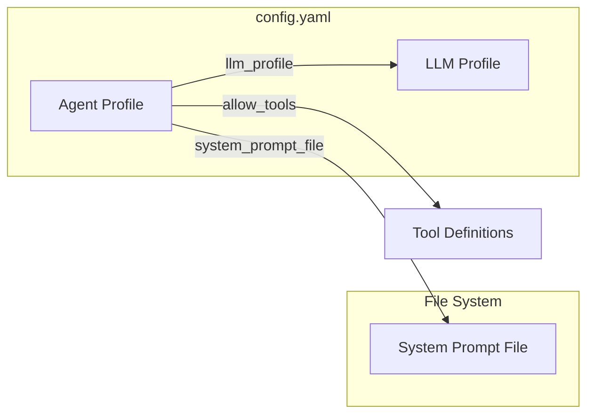

# Main Configuration Guide (`config.yaml`)

The `config.yaml` file controls the core behavior of the RadOps application, including AI models, agents, memory persistence, vector database connections and logging.

It serves as the central configuration hub, defining the infrastructure connections and cognitive architecture required for the system to operate. While other configuration files handle specific domains (e.g., `tools.yaml` for capabilities, `rbac.yaml` for permissions), `config.yaml` establishes the foundational environment settings, ensuring the application can connect to necessary services like Redis, Vault, and LLM providers.

## Index

1. [Logging](#logging)
2. [LLM (Large Language Models)](#llm-large-language-models)
3. [Agents](#agents)
4. [Sync Locations (RAG Data Sources)](#sync-locations-rag-data-sources)
5. [Memory & Persistence](#memory--persistence)
6. [Vector Store Providers](#vector-store-providers)
7. [Graph Execution](#graph-execution)
8. [Vault (Secret Management)](#vault-secret-management)
9. [Observability](#observability)

## Logging

Controls the verbosity and output destination of application logs.

| Parameter | Description | Example |
| :--- | :--- | :--- |
| `level` | Logging severity (DEBUG, INFO, WARNING, ERROR). | `"INFO"` |
| `file` | Path to the log file. If omitted, logs go to stdout. | `"/var/log/radops.log"` |
| `retention` | How long to keep log files. | `"1 week"` |
| `rotation` | Size limit before rotating logs. | `"10 MB"` |

```yaml
logging:
  level: "INFO"
  file: "logs/app.log"
  retention: "10 days"
  rotation: "50 MB"
```

## LLM (Large Language Models)

Defines the AI models used by the system. You can define multiple profiles and select a default.



### Supported Providers
*   **OpenAI** (`openai`): Cloud models such as `gpt-5` and `gpt-5-nano`.
*   **Anthropic** (`anthropic`): Cloud models such as `claude-4-5-sonnet` and `claude-4-5-opus`.
*   **DeepSeek** (`deepseek`): DeepSeek API models.
*   **Azure OpenAI** (`azure`): Azure hosted OpenAI models.
*   **Google** (`google`): Google Gemini models such as `gemini-3-pro-preview`.
*   **Groq** (`groq`): Groq Cloud models.
*   **Mistral** (`mistral`): Mistral AI models.
*   **AWS Bedrock** (`bedrock`): AWS managed models.
*   **Ollama** (`ollama`): Local models. If used for agents, the model must support tool calling.

| Parameter | Description |
| :--- | :--- |
| `provider` | The model provider (`openai`, `anthropic`, `ollama`, `deepseek`). |
| `model` | The specific model identifier (e.g., `gpt-4o`). |
| `temperature` | Creativity setting (0.0 = deterministic, 1.0 = creative). |
| `api_key` | API key (supports Vault references). If omitted, checks environment variables. |
| `api_version` | API version (required for Azure). |
| `base_url` | Endpoint URL (required for Ollama). |

### Environment Variables

If the `api_key` is not specified in the configuration profile, the system will automatically look for standard environment variables.

*   **OpenAI**: `OPENAI_API_KEY`
*   **Anthropic**: `ANTHROPIC_API_KEY`
*   **Google**: `GOOGLE_API_KEY`
*   **DeepSeek**: `DEEPSEEK_API_KEY`
*   **Groq**: `GROQ_API_KEY`
*   **Mistral**: `MISTRAL_API_KEY`

```yaml
llm:
  default_profile: "openai-main"
  profiles:
    openai-main:
      provider: "openai"
      model: "gpt-4o"
      temperature: 0.0
      api_key: "vault:system#openai_key"
    
    ollama-local:
      provider: "ollama"
      model: "llama3"
      base_url: "http://localhost:11434"

    deepseek-main:
      provider: "deepseek"
      model: "deepseek-coder"
      api_key: "vault:system#deepseek_key"

    google-main:
      provider: "google"
      model: "gemini-2.5-pro"
      api_key: "vault:system#google_key"

    groq-main:
      provider: "groq"
      model: "llama3-70b-8192"
      api_key: "vault:system#groq_key"

    mistral-large:
      provider: "mistral"
      model: "mistral-large-latest"
      api_key: "vault:system#mistral_key"

    bedrock-main:
      provider: "bedrock"
      model: "anthropic.claude-3-sonnet-20240229-v1:0"
      aws_region: "us-east-1"
      aws_access_key_id: "vault:system#aws_access_key"
      aws_secret_access_key: "vault:system#aws_secret_key"

    azure-gpt4:
      provider: "azure"
      model: "my-gpt4-deployment"
      base_url: "https://my-resource.openai.azure.com/"
      api_version: "2023-05-15"
      api_key: "vault:system#azure_key"
```

## Agents

Configures the specialized agents that the Supervisor delegates tasks to.

### Adding a Custom Agent

To add a new agent to the team, simply define it in `config.yaml`. In **Prompt Mode** (default), the system automatically registers the agent with the Supervisor.



**Routing Logic:**
The Supervisor needs to know what each agent does to route tasks effectively. RadOps constructs this "Team Member Description" using:
1.  **`system_prompt_file`**: If provided, the content of this file is used to describe the agent.
2.  **`description`**: If the file is missing, the system falls back to this short description string.

| Parameter | Description |
| :--- | :--- |
| `description` | Fallback description for the Supervisor if `system_prompt_file` is not set. |
| `llm_profile` | The ID of the LLM profile to use (defined in the `llm` section). |
| `manifest_llm_profile` | (Optional) A specific profile for generating the agent's capability manifest at startup. |
| `system_prompt_file` | Path to the text file containing the agent's instructions. |
| `allow_tools` | List of regex patterns matching the tool names this agent can access. |

```yaml
agent:
  profiles:
    # Example: A new Network Specialist
    network_specialist:
      description: "Specialist for network diagnostics and configuration."
      llm_profile: "openai-main"
      system_prompt_file: "config/prompts/network_specialist.txt"
      allow_tools:
        - system__.*      # Required for submitting work
        - network__.*     # Custom tools
        - kb_network      # Knowledge base tool
```

### Core System Agents

You can also configure the built-in system agents.

| Parameter | Description |
| :--- | :--- |
| `threshold` | (Auditor) Confidence score (0.0-1.0) required to approve an action. |

```yaml
agent:
  supervisor:
    llm_profile: "openai-main"
    discovery_mode: "prompt" # Options: "prompt" or "auto"
    discovery_threshold: 1.6
  auditor:
    enabled: true
    llm_profile: "openai-main"
    threshold: 0.8
```

## Sync Locations (RAG Data Sources)

Defined under `vector_store.profiles`, these settings control which data sources are ingested into the Knowledge Base.

### Supported Loaders
*   **File System** (`fs`): Local directories.
*   **Google Drive** (`gdrive`): Remote Google Drive folders.
*   **GitHub** (`github`): GitHub repositories (code or docs).
*   **Notion** (`notion`): Notion Pages or Databases.

| Parameter | Description |
| :--- | :--- |
| `name` | Unique identifier for the sync job. |
| `type` | The loader type (`fs`, `gdrive`, `github`). |
| `path` | The source location (path, ID, or repo slug). |
| `collection` | The destination collection in the Vector DB. |
| `sync_interval` | Polling interval in seconds. |
| `loader_config` | (Optional) Loader-specific settings (e.g., branch, extensions). |

```yaml
vector_store:
  profiles:
    - name: "ops-runbooks"
      type: "github"
      path: "my-org/runbooks"
      collection: "runbooks"
      sync_interval: 600
      loader_config:
        branch: "main"
        file_extensions: [".md", ".py", ".yaml"]

    - name: "company-wiki"
      type: "notion"
      path: "DATABASE_ID_HERE"
      collection: "wiki"
      loader_config:
        api_token: "vault:system#notion_token"
```

> **Note:** For detailed setup instructions (e.g., Google Drive credentials), refer to the **Integrations Guide**.

## Memory & Persistence

Configures Short-term and Long-term memory.

### Short-term Memory
Stores active conversation history and handles summarization.

```yaml
memory:
  short_term:
    provider: "redis"
    config:
      url: "redis://localhost:6379"
      ttl:
        time_minutes: 60
        refresh_on_read: true
    summarization:
      keep_message: 40
      token_threshold: 2000
      llm_profile: "openai-summary"
```

## Summarization

## Long term memory

## Vector Store Providers

Configures the connection details for the Vector Database used for RAG (Retrieval Augmented Generation).

**Note:** For configuring *what* data to sync (Sync Locations), please refer to the Integrations Guide.

```yaml
vector_store:
  providers:
    weaviate:
      http_host: "localhost"
      http_port: 8080
      grpc_host: "localhost"
      grpc_port: 50051
    
    chroma:
      path: "./data/chromadb"
      
    pinecone:
      api_key: "vault:vector#pinecone_key"
      index_name: "radops-index"
```

## Graph Execution

Controls the execution parameters of the workflow.

| Parameter | Description |
| :--- | :--- |
| `recursion_limit` | Maximum number of steps the graph can take before stopping (prevents infinite loops). |
| `max_concurrency` | Maximum number of parallel tasks the graph can execute. |

```yaml
graph:
  recursion_limit: 30
  max_concurrency: 10
```

## Vault (Secret Management)

Configures the connection to HashiCorp Vault for secure secret retrieval.

```yaml
vault:
  url: "http://localhost:8200"
  token: "root-token" # Recommended: Use VAULT_TOKEN env var instead
  mount_point: "secret"
```

### Using Secrets
Reference secrets in any config file using the syntax: `vault:<path>#<key>`.

Example: `api_key: "vault:system/openai#api_key"`

## Observability

Configures OpenTelemetry tracing and Prometheus metrics.

```yaml
observability:
  enable_tracing: true   # Default: false
  enable_metrics: true   # Default: true
  tracing_endpoint: "http://tracing-backend:4317" # Optional override
  metrics_endpoint: "http://metrics-backend:4317" # Optional override
  prometheus:
    address: "0.0.0.0"
    port: 9464
```
